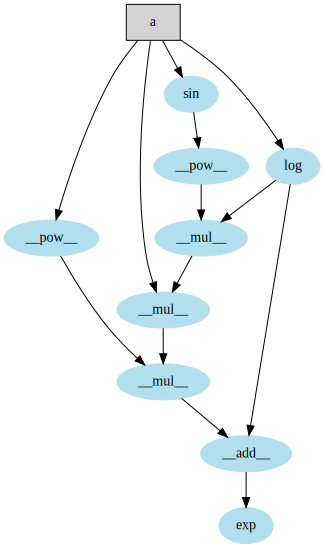

# simple_autograd_numpy

A simple autograd implementation and tests based on https://github.com/karpathy/micrograd/blob/master/micrograd/engine.py
Just for learning.

```python
import numpy as np
from tensor import Tensor

a = Tensor(np.array([1], dtype=np.float32), name='a')
b = Tensor(np.array([2], dtype=np.float32), name='b')
c = Tensor(np.array([3], dtype=np.float32), name='c')

d = (a * b).sin()
e = (c - (a / b)).exp()
f = d + e
y = (f * f * f * f).log() * c
y
tensor([30.863823], dtype=float32)

a.grad, b.grad, c.grad, d.grad, e.grad, f.grad

(array([-6.3461523], dtype=float32),
 array([2.4101915], dtype=float32),
 array([21.454475], dtype=float32),
 array([0.9166051], dtype=float32),
 array([0.9166051], dtype=float32),
 array([0.9166051], dtype=float32))

a = Tensor(np.array([2], dtype=np.float32), name='a')

def fn(a):
    b = a.sin()
    c = a.log()
    d = c/b*a
    return (c+d-a).exp()

e = fn(a)

e.backward()

e.generate_graph()
```
